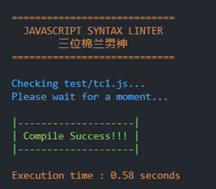
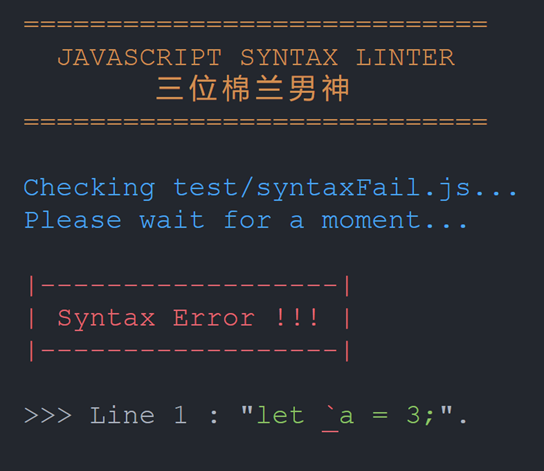
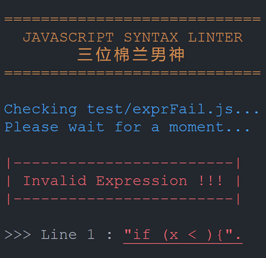

# Javascript Syntax Linter
Tugas Besar IF2124 Teori Bahasa Formal dan Automata

## Table of Contents
* [General Info](#general-information)
* [Tampilan Program](#tampilan-program)
* [How To Run](#how-to-run)
* [Tech Stack](#tech-stack)
* [Project Structure](#project-structure)
* [Author](#author)

## General Information
JavaScript linters are tools that you can use to help you debug your code.
They scan your scripts for common issues and errors, and give you back a report with line numbers that you can use to fix things.
In addition to actual bugs and errors, they also check for subjective, stylistic preferences as well. Did you include a space between the function name and parentheses? Did you use single or double quotes around strings? Things like that.

## Tampilan Program
### Compile Success 

<br />

### Syntax Error

<br />

### Expression Error


## How To Run
In terminal (recommended `powershell`), run:
```shell
python ./main.py "javascript-file-directory/javascript-file.js"
```
Make sure the "javascript-file-directory" path is correct.

## Tech Stack
* Python Programming
* Cocke–Younger–Kasami (CYK) Algorithm
* Context Free Grammar (CFG) to Chomsky Normal Form (CNF) Conversion
* Context Free Grammar (CFG)
* Finite Automata (FA)

## Project Structure
```bash
.
│   main.py
│   lexer.py
│   FA.py
│   CFG.py
│   CYK.py
│   grammar.txt
│   README.md
│   .gitignore
│
├───test
│
└───screenshot
```

## Author
### 三位棉兰男神
* 13521046 周伟林 Jeffrey Chow
* 13521054 陈维康 Wilson Tansil
* 13521102 李健康 Jimly Firdaus